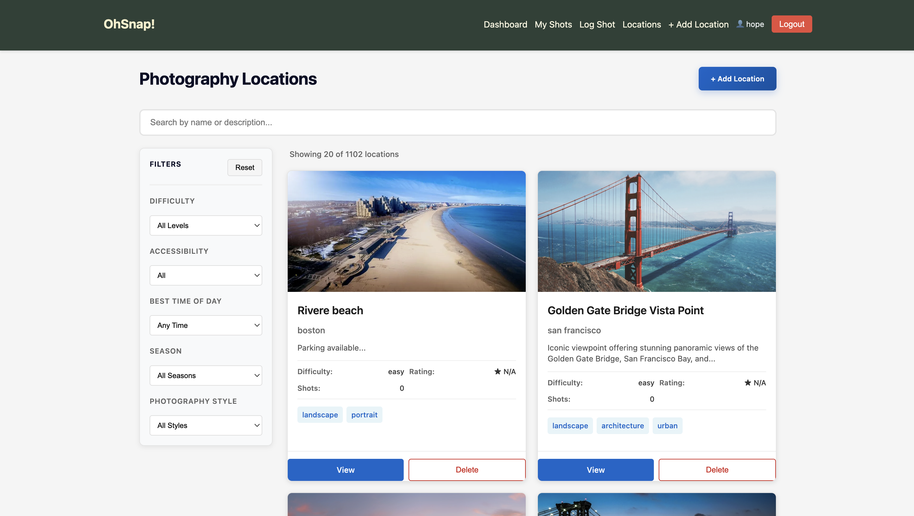
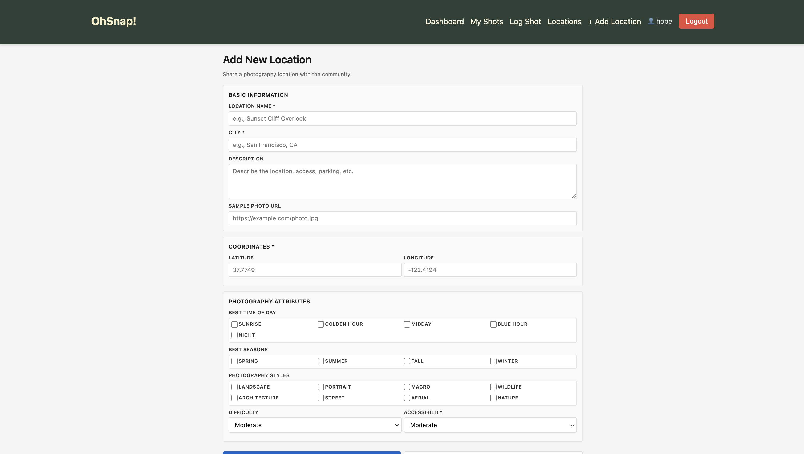
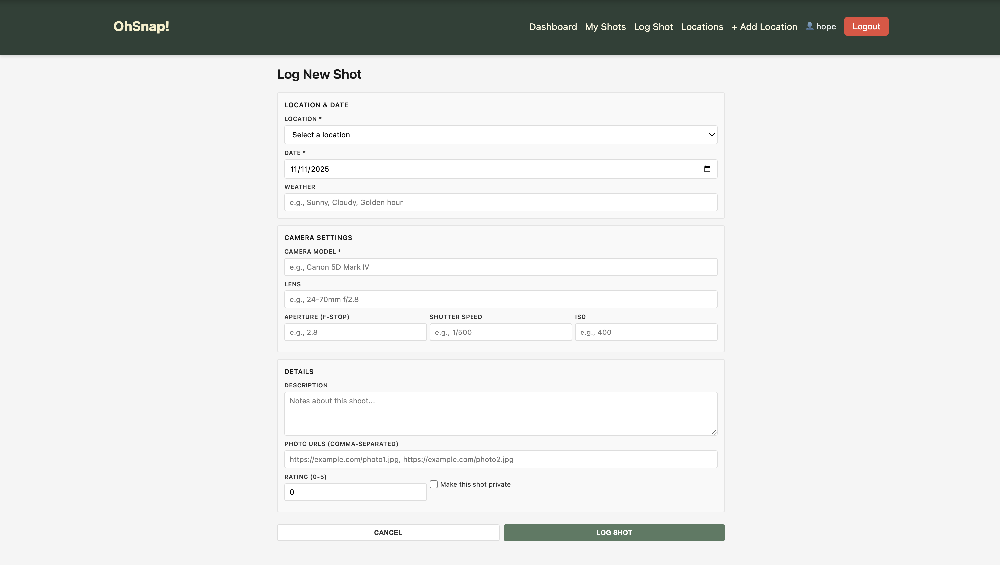
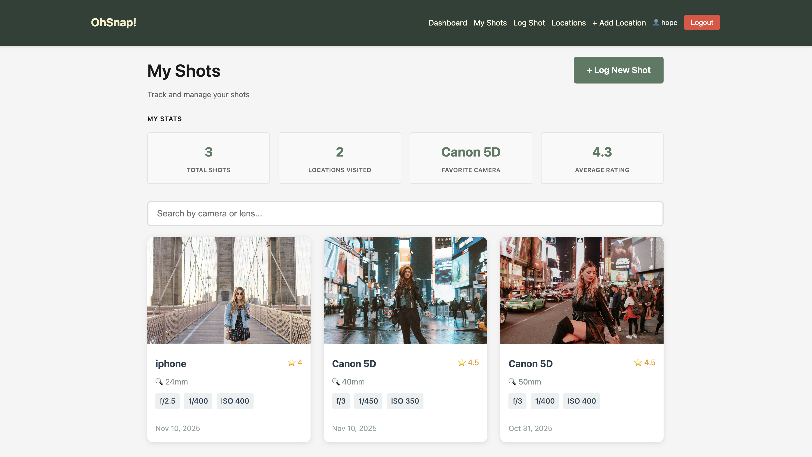
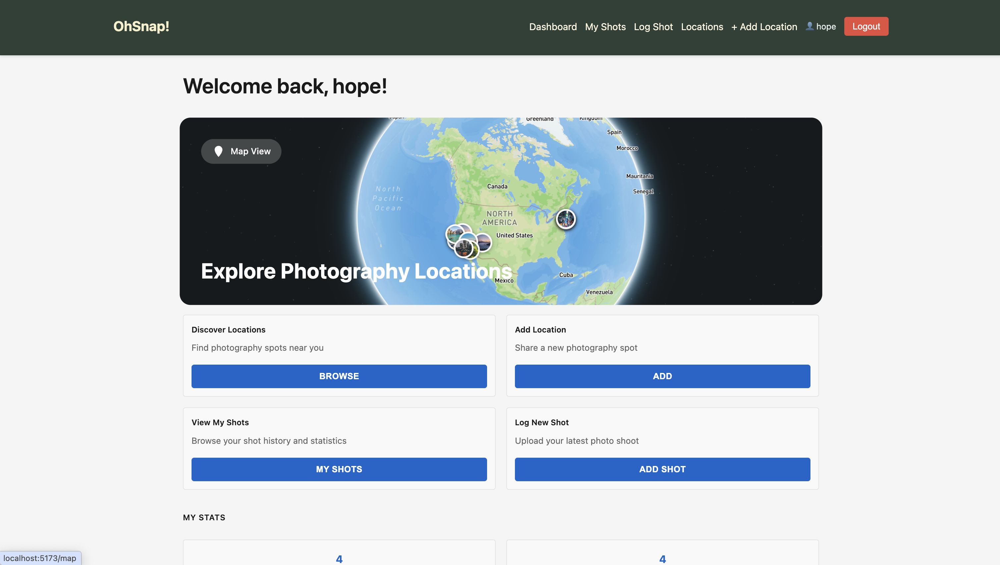
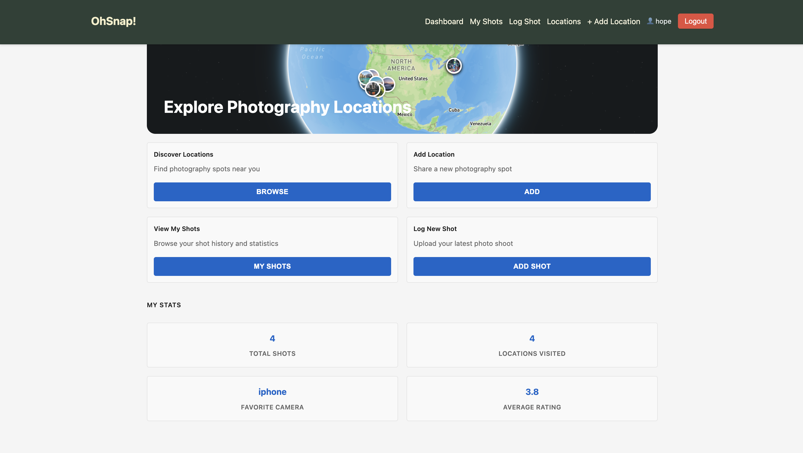
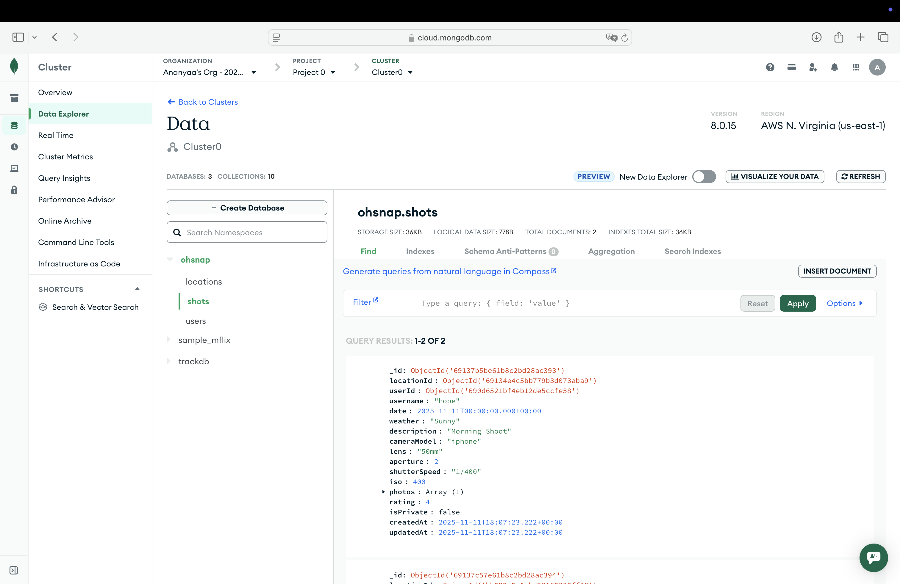
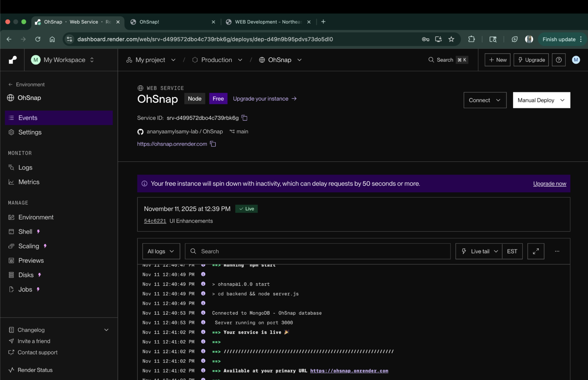

# OhSnap!

## Authors

**Author 1:**  
Name: Ananyaa Mylsamy  
Email: mylsamy.a@northeastern.edu  
NUID: 002022427

**Author 2:**  
Name: Manasha Sekar  
Email: sekar.ma@northeastern.edu  
NUID: 002711528

## Web Development

[View Course link](https://northeastern.instructure.com/courses/226004)

## Objective

Build a collaborative photography platform where photographers discover hidden gem locations, log photo shoots with detailed camera metadata, and help the community find the best spots based on style, time of day, season, and conditions using React, Node.js, Express, and MongoDB.

## Features

- **User Authentication & Profiles** - Secure signup/login system for photographers to manage their shot history and profile
- **Shot Tracking & Camera Metadata** - Log photo shoots with location, date/time, weather, and complete camera metadata (model, lens, aperture, shutter speed, ISO); view shot history and statistics
- **Location Database** - Discover and post photography locations with GPS coordinates, best time of day, seasons, accessibility, and sample photos
- **Photographer Analytics** - View statistics including total shots, favorite camera/lens, keeper ratio, and most-visited locations
- **Community Integration** - See trending locations, most-used camera gear at each spot, and browse other photographers' profiles and shot galleries

## Screenshots

### Home Page and Map Feature

<div align="center">
  
  
</div>

### View and Add Location

<div align="center">
  
  
</div>

### Add and View Shots

<div align="center">
  
  
</div>

### Dashboard and Stats

<div align="center">
  
  
</div>

### MongoDB Atlas and Render

<div align="center">
  
  
</div>

## Design Document

[View Design Document](https://docs.google.com/document/d/14lqj578vwxCjqC0RU1qotqhrvn7PvLqocm_cNUkajx8/edit?usp=sharing)

## Live Webpage

[Visit Live Site](https://ohsnap.onrender.com)

## Presentation

[View Presentation Slides](https://docs.google.com/presentation/d/1wYwPTzhxg-QC81eqDIFUv5eIaByD9ExLh5nAZymkYRU/edit?usp=sharing)

## Tech Stack

**Backend:** Node.js + Express (ES6 modules), MongoDB (official driver, NO Mongoose), Express-session  
**Frontend:** React (Hooks, Router, CSS Modules, PropTypes), HTML, CSS  
**Tools:** ESLint + Prettier, Vite, Render

## Team Responsibilities

**Ananyaa Mylsamy** - Shot CRUD (backend routes/validation), photography statistics, photographer profiles, ShotForm/List/Detail/Dashboard components

**Manasha Sekar** - Location CRUD (backend routes/validation), search/filters, LocationForm/List/Detail/Map components

**Shared:** User authentication, navigation, linking photographers to locations

## Instructions to Build

### Prerequisites

- Node.js (v18+)
- MongoDB Atlas account
- Mapbox account with a free access token
- npm

### Setup Steps

1. Clone repository

   ```bash
   git clone git@github.com:ananyaamylsamy-lab/OhSnap.git
   cd OhSnap
   ```

2. Install backend dependencies

   ```bash
   cd backend
   npm install
   ```

3. Install frontend dependencies

   ```bash
   cd ../frontend
   npm install
   ```

4. Set up environment variables  
   Create a `.env` file in the `backend` directory:
   ```
   MONGODB_URI=mongodb+srv://<username>:<password>@cluster.mongodb.net/ohsnap
   PORT=3000
   SESSION_SECRET=your-secret-key-min-32-chars
   NODE_ENV=development
   ```
   Create a `.env` file in the `frontend` directory:
   ```
   VITE_MAPBOX_TOKEN=your_mapbox_access_token_here
   ```

### Running the Project

**Development mode:**

```bash
# Terminal 1 - Backend
npm run dev

# Terminal 2 - Frontend
npm run dev:frontend
```

Backend runs at: `http://localhost:3000`  
Frontend runs at: `http://localhost:5173`

**Production build:**

```bash
npm run build:frontend
npm start
```

## Database Collections

**Database Name:** `ohsnap`

### Collections:

1. **users** - User accounts with auth and profile data
2. **shots** - Photo shoot logs with camera metadata
3. **locations** - Photography spot database

## License

MIT License - Permission is hereby granted to use, copy, modify, and distribute this software.

## Contact

**Author 1:**

- Email: mylsamy.a@northeastern.edu
- LinkedIn: [linkedin.com/in/ananyaa-mylsamy/](https://www.linkedin.com/in/ananyaa-mylsamy/)
- GitHub: [github.com/Anumyl](https://github.com/Anumyl)

**Author 2:**

- Email: sekar.ma@northeastern.edu
- LinkedIn: [linkedin.com/in/manasha-sekar](https://www.linkedin.com/in/manasha-sekar-240326148)
- GitHub: [github.com/manasha](https://github.com/manasha2402)

## GenAI Documentation

- Used Claude Model for MapBox (for coordinates mapping and map generation)
